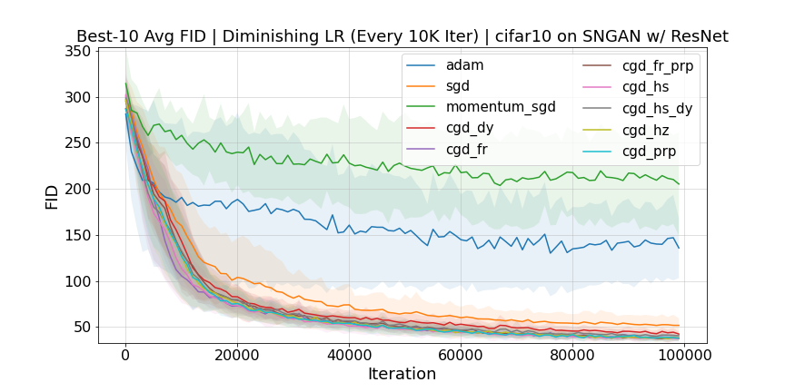

# Conjugate Gradient Method for Generative Adversarial Networks @AISTATS2023

## Abstract
Generative models such as used for image generation are required to solve the Jensen–Shannon divergence minimization problem between the model distribution and the data distribution, which is computationally infeasible.
Generative Adversarial Networks (GANs)  formulate this problem as a game between two models, a generator and a discriminator, whose learning can be formulated in the context of game theory and the local Nash equilibrium (LNE).
This optimization is more complicated than minimizing a single objective function. Hence, it would be difficult to show stability and optimality for the existing methods for this optimization. 
Here, we propose applying the conjugate gradient method that can solve stably and quickly general large-scale stationary point problems to the LNE problem in GANs.
We give proof and convergence analysis under mild assumptions showing that the proposed method converges to a LNE with three different learning rate update rules, including a constant learning rate as the first attempt ever. 
Finally, we present results that the proposed method outperforms stochastic gradient descent (SGD), momentum SGD, and achieves competitive FID score with Adam in terms of FID score.

## Additional Experimental Results for Rebuttal

We additionally conducted experiments on SNGAN w/ ResNet generator as diminishing return experiments. We report the best FID and the best-10 FID by using grid search to find hyperparameters.
It should be noted that the previous study [Miy+2017] used the Chainer framework, while our implementation uses Pytorch.
In our experiments, Adam updated FID scores of [Miy+2017] because of sufficient hyperparameter search.
However, Adam has stronger hyperparameter sensitivities, and Conjugate gradient methods outperform the other optimizers in the average of the Best-10 FIDs.

|                                       | Adam         | SGD        | Momentum SGD  | CGD_DY      | CGD_FR     | CGD_FR_PRP | CGD_HS     | CGD_HS_DY  | CGD_HZ     | CGD_PRP    |
|---------------------------------------|--------------|------------|---------------|-------------|------------|------------|------------|------------|------------|------------|
| Miy+2017 (Constant LR)                | 21.7         | -          | -             | -           | -          | -          | -          | -          | -          | -          |
| Ours (Constant LR) / Top1             | 19.38        | 30.34      | 34.42         | 30.13       | 26.02      | 30.31      | 29.29      | 29.54      | 29.41      | 28.94      |
| Ours (Diminishing LR) / Top1          | 51.96        | 40.55      | 73.66         | 35.29       | 32.17      | 31.06      | 30.03      | 29.09      | 29.64      | 30.47      |
| Ours (Constant LR) / Top10 Average    | 51.16±33.71  | 41.09±8.13 | 82.15±51.82   | 33.70±2.04  | 29.63±2.26 | 34.78±2.17 | 34.82±1.07 | 34.12±1.31 | 34.28±0.96 | 34.53±2.01 |
| Ours (Diminishing LR) / Top10 Average | 135.86±32.65 | 51.80±7.84 | 205.29±59.333 | 42.39±12.89 | 38.20±8.82 | 37.39±2.74 | 36.96±2.77 | 39.90±3.06 | 38.24±2.97 | 37.94±3.62 |




## Prerequisites

```sh
gcc==7.4.0
python >= 3.7
cuda == 11.1
cudnn == 8.1
```

## Downloads
- [MNIST Datasets](http://yann.lecun.com/exdb/mnist/)
- [CIFAR10 Datasets](https://www.cs.toronto.edu/~kriz/cifar.html)
- [CelebA Datasets](https://mmlab.ie.cuhk.edu.hk/projects/CelebA.html)
- [Pretrained Inception Model](https://github.com/mseitzer/pytorch-fid/releases) for Calculationg FID


## Installation

#### Install Dependent Libraries

```sh
pip install -r requirements.txt
```

#### Fix Environment Path

```sh
vim ./exp/env_common.sh
```

#### Fix Wandb Entity Path

For example, if you want to do a CIFAR10 on SNGAN w/ ResNet Generator, grid search for the ConstantLR case, you will need to modify the following file.

```sh
vim ./sweep_config/CL_RESNET_CIFAR10/sgd.yaml
```

Please change entity name `XXXXXX` to your wandb entitiy.


```yaml
project: CL_RESNET_CIFAR10
entity: XXXXXX
program: main.py
method: grid
```

## Sweep

This section shows how to grid-search sgd's hyperparameters. Other optimizers can be executed in the same way.


#### ConstantLR SNGAN w/ ResNet Generator on CIFAR10

```sh
cd exp/sweep_scripts/CL_RESNET_CIFAR10/
./sweep_agent_sgd.sh
```


#### DiminishingLR SNGAN w/ ResNet Generator on CIFAR10

```sh
cd exp/sweep_scripts/DL_RESNET_CIFAR10/
./sweep_agent_sgd.sh
```


